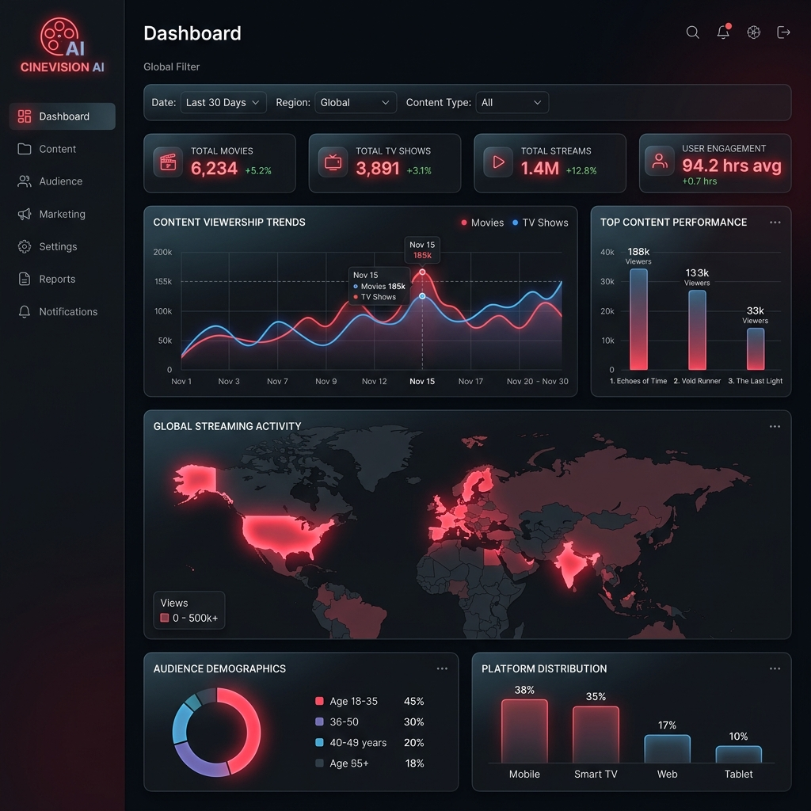
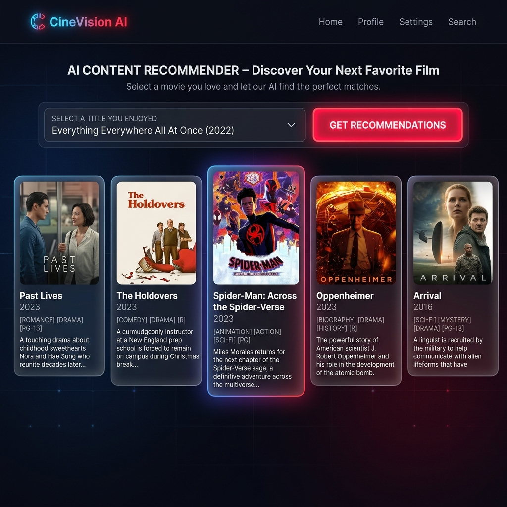
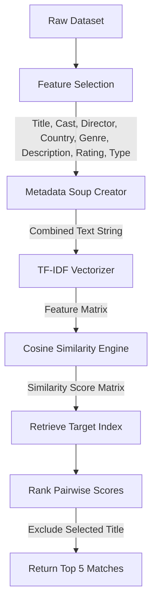

# 🎬 CineVision AI — Streaming Platform Intelligence Dashboard

<p align="center">
  
</p>

<p align="center">
  
  
  
  
  
</p>

---

## 📖 Project Overview

**CineVision AI** is a premium, cyber-themed Streaming Intelligence Dashboard designed to provide production executives, acquisition teams, and platform designers with actionable catalog insights. 

Built with a sleek, high-contrast dark theme, it transforms raw streaming metadata (specifically Netflix titles) into visual charts, geographic density maps, and automated strategic reports. Additionally, CineVision AI features a content-based recommendation engine powered by NLP vector space models, demonstrating how machine learning can drive subscriber engagement and retention.

---

## ✨ Features

- **📊 Executive KPI Dashboard**: Real-time glassmorphic counters displaying total titles, movie/TV ratios, and global production footprints.
- **🌍 Choropleth Geographic Density**: An interactive global production map tracking catalog representation by country.
- **📈 Advanced Distribution Charts**: 
  - Donut chart representing catalog composition.
  - Horizontal bar charts ranking top producing countries and genres.
  - Interactive age rating demographics bar charts.
  - Content growth timeline featuring filled area glowing curves.
- **🤖 Automated AI Insights Panel**: Real-time business highlights and dynamic strategic recommendations tailored to filtered data.
- **📥 PDF Report Compiler**: Generates publication-ready executive summary PDF reports featuring table structures and insight summaries on the fly.
- **🧠 ML Content Recommender**: Select any title to immediately discover the top 5 most similar titles based on content, cast, director, and metadata features.
- **🍿 Interactive Catalog Search**: A multi-keyword search index that filters matching titles, directors, actors, countries, and genres.

---

## 🛠️ Tech Stack

CineVision AI leverages a robust python data ecosystem alongside high-end styling technologies:

* **Dashboard Framework**: [Streamlit](https://streamlit.io/) (Rapid UI prototyping & reactive state management)
* **Data Wrangling & Processing**: [Pandas](https://pandas.pydata.org/) & [NumPy](https://numpy.org/)
* **Interactive Data Visualization**: [Plotly](https://plotly.com/) & [Plotly Express](https://plotly.com/python/plotly-express/) (Responsive SVG visualizations with customized themes)
* **Machine Learning & NLP**: [Scikit-Learn](https://scikit-learn.org/) (Vectorization & vector similarity matching)
* **Automated Document Layout**: [ReportLab](https://www.reportlab.com/) (Dynamic PDF rendering with custom style sheets)
* **Styling**: Google Fonts (Outfit & Inter), Vanilla CSS stylesheets featuring neon red branding accents and glassmorphic micro-shadows.

---

## 📂 Folder Structure

The repository is modularly structured, separating data extraction, UI layouts, styling, and model logic:

```text
CineVision-AI/
├── assets/
│   └── style.css            # Custom CSS for Netflix-style glassmorphism & typography
├── data/
│   └── datanetflix_titles.csv # Dataset of titles (movies, TV shows, and attributes)
├── reports/
│   └── executive_report.pdf # Generated PDF reports exported dynamically
├── screenshots/
│   ├── banner.png           # Repository header banner
│   ├── dashboard_mockup.png # Dashboard interface screenshot
│   └── recommender_mockup.png # Recommendation engine visual layout
├── src/
│   ├── __init__.py          # Marks the directory as a Python package
│   ├── charts.py            # High-end Plotly visualization configurations
│   ├── dashboard.py         # Handles dataset loading and metric KPI widgets
│   ├── filters.py           # Sidebar selection panels and filtering logic
│   ├── geo_analytics.py     # Interactive global choropleth layout
│   ├── insights.py          # AI business highlights and strategic analysis logic
│   ├── recommender.py       # Core similarity scoring & TF-IDF model
│   └── report_generator.py  # ReportLab layout, table builders, and PDF compiler
├── app.py                   # Main entry point & reactive application router
└── requirements.txt         # Comprehensive Python library dependencies
```

---

## 📸 Gallery & Screenshots

Here is a look at the CineVision AI platform in action:

| **Executive Analytics & Geo-Map** |
|:---:|
|  |
| *Visualizes KPI counters, geographic maps, distribution charts, and real-time AI Insights.* |

| **AI Recommendation Interface** |
|:---:|
|  |
| *Select catalog entries and immediately discover relevant recommendations with glassmorphic cards.* |

---

## 🤖 Recommendation Engine Explanation

The recommendation system in CineVision AI uses content-based filtering powered by Natural Language Processing (NLP) techniques:



### Technical Workflow
1. **Metadata Soup Compilation**: Rather than vectorizing description text alone, a unified metadata string ("soup") is built for each title by combining:
   $$\text{Soup} = \text{Title} + \text{Director} + \text{Cast} + \text{Country} + \text{Genre} + \text{Description} + \text{Rating} + \text{Type}$$
2. **TF-IDF Vectorization**: A Term Frequency-Inverse Document Frequency (TF-IDF) Vectorizer computes numerical weights for keywords, penalizing commonly recurring stop words (like "the", "and") while elevating unique genres, names, and themes.
3. **Cosine Similarity**: The vector representations are evaluated using the cosine similarity metric:
   $$\text{similarity}(\vec{A}, \vec{B}) = \frac{\vec{A} \cdot \vec{B}}{\|\vec{A}\| \|\vec{B}\|}$$
   This scores the spatial angle between movie vectors in the TF-IDF space. Titles with matching directors, cast, or similar plot descriptions produce high score coefficients close to $1.0$.
4. **Fuzzy Search & Index Extraction**: The application accepts selection, isolates the target movie vector, ranks all other entries by similarity, and filters out the query title to present 5 relevant suggestions.

---

## 📊 Analytics Features

CineVision AI goes beyond standard charting to provide predictive value for streaming operations:

- **🌍 Geographic Production Tracking**: Recognizes top-performing country hubs, allowing studios to make informed decisions on international localization and tax incentive investments.
- **💡 Automated AI Insights Panel**: 
  - **Dynamic Highlights**: Computes production peak years, rating majorities, and content ratios on the filtered data sub-selection.
  - **Strategic Recommendation**: Offers data-backed advice (e.g., recommending serialized drama investments in underrepresented regions if TV Show counts fall below $35\%$).
- **🕒 Production Growth Curve**: Track the volume of releases over time with area-fill line charts, mapping platform content density trends.
- **📄 Dynamic PDF Executive Compiler**: Pressing the sidebar export compile button compiles a ReportLab PDF document containing active analytics KPIs, formatted tables, and bulleted highlights.

---

## 🚀 Installation Guide

Ensure you have Python 3.9 or higher installed. Follow these setup steps:

### 1. Clone the Repository
```bash
git clone https://github.com/your-username/CineVision-AI.git
cd CineVision-AI
```

### 2. Set Up Virtual Environment
Initialize a clean Python virtual environment to manage dependencies:

```bash
# Windows
python -m venv venv
venv\Scripts\activate

# macOS / Linux
python3 -m venv venv
source venv/bin/activate
```

### 3. Install Dependencies
Install all package requirements defined in the manifest:

```bash
pip install --upgrade pip
pip install -r requirements.txt
```

---

## 📖 Usage Guide

To launch the CineVision AI platform:

```bash
streamlit run app.py
```

### Navigating the Interface
1. **Side Panel Filters**: Use the sidebar to restrict the active dataset by *Content Type* (Movies/TV Shows), *Production Country*, *Age Rating*, and *Release Year Range*.
2. **Report Exporting**: Click **"Download Executive PDF Report"** in the sidebar. The system will compile the current filtered data into a PDF report layout and trigger a browser download.
3. **AI Recommendations**: Scroll to the recommendation section, select a title from the dropdown, and click **"Get Recommendations"** to view recommendations.
4. **Keyword Exploration**: In the catalog table explorer, enter keywords (e.g., "Christopher Nolan", "Action") to view matching titles.

---

## 🔮 Future Scope

- **👥 Collaborative Filtering**: Integrate user ratings data to implement hybrid recommendation filtering.
- **🕸️ Talent Network Visualization**: Build interactive node-link graphs displaying actor-director collaboration networks.
- **🖼️ TMDB API Integration**: Dynamically query film poster artwork and trailer media.
- **🐋 Containerized Deployment**: Package the application with Docker and deploy to Streamlit Community Cloud or AWS ECS.

---

## ✍️ Author & Contact

Developed with 💖 for the entertainment analytics community.

- **Author**: Your Name
- **GitHub**: [@yourusername](https://github.com/your-username)
- **LinkedIn**: [Your Profile](https://linkedin.com/in/yourprofile)
- **Email**: your.email@example.com
